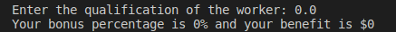
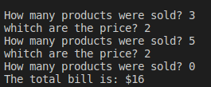

# UNIT 2 CONTROL STRUCTURES AND CYCLES
 
 
 
## ***DESCRIPTION***
In this unit we are going to work with some cycles such as: while, do while and for. We are also going to have to use creativity and intelligence to be able to develop a fast and efficient program.
 
 ## ***UNIT EXERCISES***

 [EXERCISE 1](https://github.com/Up210188/Up210188_cpp/tree/main/U2%20Control%20structures%20and%20cycles#exercise-1)

 [EXERCISE 2](https://github.com/Up210188/Up210188_cpp/tree/main/U2%20Control%20structures%20and%20cycles#exercise-2)

 [EXERCISE 3](https://github.com/Up210188/Up210188_cpp/tree/main/U2%20Control%20structures%20and%20cycles#exercise-3)

 [EXERCISE 4](https://github.com/Up210188/Up210188_cpp/tree/main/U2%20Control%20structures%20and%20cycles#exercise-4)

 [EXERCISE 5](https://github.com/Up210188/Up210188_cpp/tree/main/U2%20Control%20structures%20and%20cycles#exercise-5)

 [EXERCISE 6](https://github.com/Up210188/Up210188_cpp/tree/main/U2%20Control%20structures%20and%20cycles#exercise-6)

 [EXERCISE 7](https://github.com/Up210188/Up210188_cpp/tree/main/U2%20Control%20structures%20and%20cycles#exercise-7)
 
 [EXERCISE 8](https://github.com/Up210188/Up210188_cpp/tree/main/U2%20Control%20structures%20and%20cycles#exercise-8)


 ## ***EXERCISE 1***

 ### Description:
 This program asks the user how much his annual income is and if it is less than 10,000 he pays 5% tax, if it is from 10,000 to 20,000 he pays 15%,  if the income is from 20,000 to 35,000 he pays 20%, if it is from 35,000 to 60,000 pay 30% and if it is more than 60,000 pay 45%.

 ### Data entry:
```c++
        //It asks the user for their annual income and saves it
        cout<<"What is your annual income in pesos? "; cin>>renta;
```

 ### Process:
  
  ```c++
        //Check that the user entered his income correctly
        if(renta<=0){
        cout<<"Please check the value of your rent well"<<endl;
        }

        //Check the income to see what percentage of tax corresponds
        else{
            if(renta<10000){
            porcentaje=5;
            }    
        
            else if(renta>=10000 && renta<20000){
            porcentaje=15;
            }

            else if(renta>=20000 && renta<35000){
            porcentaje=20;
            }

            else if(renta>=35000 && renta<60000){
            porcentaje=30;
            }    
            
            else if(renta>=60000){
            porcentaje=45;
            }

            //Prints the percentage and the value of the tax
            impositivo=renta*porcentaje/100;
            cout<<"Your tax is "<<porcentaje <<"%  and it will pay $"<<impositivo<<endl;
        }
  ```    
  ### Data output:
  ``` c++
        cout<<"Please check the value of your rent well"<<endl;
       
        cout<<"Your tax is "<<porcentaje <<"%  and it will pay $"<<impositivo<<endl;
  ```
### Explanation:
1.- first ask the user what his annual income is.

2.- Then check that the rent is correct and if it is incorrect it prints Error.

3.-Afterwards, with an if, compare the income to know which tax percentage corresponds to it.

4.- Then multiply the percentage by the rent and divide by 100.

5.- Finally, print the corresponding tax.
   ### Tests:
Case A: The user mistyped the rent.

 

Case B: The user pays less than 10,000.

 

Case C: The user pays between 10,000 and 20,000.

 

Case D: The user pays between 20,000 and 35,000.

 

Case E: The user pays between 35,000 and 60,000.

 

Case F: The user pays more than 60,000.

  

## ***EXERCISE 2***
### Description:
In a certain company, its employees are evaluated at the end of each year.
The points that can be obtained in the evaluation start at 0.0 and can go up,
translating into better benefits. The points you can get
employees can be 0.0, 0.4, 0.6 or more, but not intermediate values
between the figures mentioned. Below is a table with the
levels corresponding to each score. The amount of money earned
on each level is $2,400 multiplied by the level score.

Level Score
Unacceptable 0.0
Acceptable 0.4
Merit 0.6 or more
Write a program that reads the user's score and indicates their level of performance,
as well as the amount of money the user will receive.
*Thank you very much for choosing us! We hope to serve you again.
 
### Data entry:
```c++
        //Ask the user for the employee's qualification
          cout<<"Enter the qualification of the worker: "; cin>>calificacion;
```

### Process:
  
  ```c++
        //Analyze the qualification to know what percentage of the bonus the employee will obtain
        if(calificacion==0.0||calificacion==0.4||calificacion>=0.6&&calificacion<=1){

            dineroConseguido= 2400*calificacion;
            porcentaje=calificacion*100;
            cout<<"Your bonus percentage is "<<porcentaje<<"% and your benefit is $"<<dineroConseguido<<endl;
        }

        //Check that the rating was correct
        else{
            cout<<"Please check your rating "<<endl;
        }
  ```    
### Data output:
  ``` c++
        cout<<"Your bonus percentage is "<<porcentaje<<"% and your benefit is $"<<dineroConseguido<<endl;
        cout<<"Please check your rating "<<endl;
  ```
### Explanation:
1.-First ask the qualification of the worker.

2.- Then, with an if, analyze that the rating is 0.0 or 0.4 or greater than 0.6 and less than 1.

3.- If the rating is incorrect, print Please check your rating.

4.- If the rating is correct, multiply the rating by 24000 and then multiply the rating by 100 to get the percentage.

5.- Finally, print the percentage and benefit.

### Tests:
Case A:The worker's rating is 0.

 

Case B:The worker rating is 0.4.

 


Case C:The worker's rating is greater than 0.6.

 

Case D:The worker's rating is greater than 1.

 

## ***EXERCISE 3***
### Description:
Write a program for a company that has game rooms for all ages and wants 
to automatically calculate the price to charge its customers to enter. The
The program must ask the user for the customer's age and display the price of the ticket. Yes
the client is under 4 years old can enter for free, if they are between 4 and 18 years old they 
must pay $5 and if they are over 18 years old, $10.
 
### Data entry:

  ```c++
        //ask the client's age
        cout<<"How is the age of the client? "; cin>>edad;
       
  ```   

### Process:
  
  ```c++
        //check that the age is correct
        if(edad<0){
            cout<<"Please check the age"<<endl;
        }
        //check the age to see how much the client will pay
        else{
            if(edad>=0&&edad<4){
                precio=0;
            }
            else if(edad>=4&&edad<=18){
                precio=5;
            }
            else {
                precio=10;
            }

            //print the price of the ticket
            cout<<"The price of the ticket is $"<<precio<<endl;
        }
       
  ```    
### Data output:
  ``` c++
         //print the price of the ticket
            cout<<"The price of the ticket is $"<<precio<<endl;
  ```
### Explanation:

1.- Ask the user his age.

2.- Then with an if check that the age is correct.
3.- If the age is correct, check if the age is less than 4, print that the ticket is $0.

4.-If it is not less than 4, check that it is greater than 4 and less than or equal to 18 and print that the ticket is $5.

5.- Finally, if you are over 18, print that the ticket is $10.

### Tests:
Case A:The user puts his age wrong.

 

Case B:The user puts his age less than 4.

 

Case C:The user puts his age greater than 4 and less than or equal to 18.

 

Case D:The user puts his age greater than 18.

 

## ***EXERCISE 4***
### Description:
The Bella Napoli pizzeria offers vegetarian and non-vegetarian pizzas to its customers. The
Ingredients for each type of pizza are listed below.
*Vegetarian ingredients: Pepper and tofu.
*Non-vegetarian ingredients: Pepperoni, Ham and Salmon.
Write a program that asks the user if he wants a vegetarian pizza or not, and in
Based on your answer, show you a menu with the ingredients available for you to choose from.
You can only choose one ingredient besides the mozzarella and the tomato that are in all the
pizza.
At the end it should be shown on the screen if the chosen pizza is vegetarian or not and all the
ingredients it contains.
 
### Data entry:

```c++
        // ask the user whitch pizza he wants
        cout<<"Do you want a vegetarian pizza? yes=1 no=2 ";cin>>menu;
        cout<<"Do you want a peppers? yes=1"<<endl<<"Do you want a tofu? yes=2 "<<endl<<"You answer is: ";
        cout<<"Do you want a pepperoni? yes=1"<<endl<<"Do you want a ham? yes=2 "<<endl<<"Do you want a salmon? yes=3"<<endl<<"You answer is: ";
```

### Process:
  
  ```c++
        //shows the ingredients of the vegetarian pizza
        if(menu==1){
            //the user can choose the ingredient for the vegetarian pizza
            cout<<"Please choose only one ingredient"<<endl;
            cout<<"Do you want a peppers? yes=1"<<endl<<"Do you want a tofu? yes=2 "<<endl<<"You answer is: ";
            cin>>ingredientes;
            if(ingredientes==1){
                cout<<" Your pizza is vegetarian and the ingredients are the mozzarella, the tomato and pappers"<<endl;
            }
            else if(ingredientes==2){
                cout<<" Your pizza is vegetarian and the ingredients are the mozzarella, the tomato and tofu"<<endl;
            }
            //print the error in the ingredients
            else{
                cout<<"Please choose a ingredient"<<endl;
            }
        }
        //shows the ingredients of the non-vegetarian pizza
        else if(menu==2){
            //the user can choose the ingredient for the non-vegetarian pizza
            cout<<"Please choose only one ingredient"<<endl;
            cout<<"Do you want a pepperoni? yes=1"<<endl<<"Do you want a ham? yes=2 "<<endl<<"Do you want a salmon? yes=3"<<endl<<"You answer is: ";
            cin>>ingredientes;
            if(ingredientes==1){
                cout<<" Your pizza isn't vegetarian and the ingredients are the mozzarella, the tomato and pepperoni "<<endl;
            }
            else if(ingredientes==2){
                cout<<" Your pizza isn't vegetarian and the ingredients are the mozzarella, the tomato and ham"<<endl;
            }

            else if(ingredientes==3){
                cout<<" Your pizza isn't vegetarian and the ingredients are the mozzarella, the tomato and salmon"<<endl;
            }
            //print the error in the ingredients
            else{
                cout<<"Please choose a ingredient"<<endl;
            }
         }
        //print the error in the pizza

        else{
            cout<<"Please choose a pizza"<<endl;
        }
       
  ```    
### Data output:
  ```c++
        cout<<" Your pizza is vegetarian and the ingredients are the mozzarella, the tomato and pappers"<<endl;
        cout<<" Your pizza is vegetarian and the ingredients are the mozzarella, the tomato and tofu"<<endl;
        cout<<"Please choose a ingredient"<<endl;
        cout<<" Your pizza isn't vegetarian and the ingredients are the mozzarella, the tomato and pepperoni "<<endl;
        cout<<" Your pizza isn't vegetarian and the ingredients are the mozzarella, the tomato and ham"<<endl;
        cout<<" Your pizza isn't vegetarian and the ingredients are the mozzarella, the tomato and salmon"<<endl;
        cout<<"Please choose a pizza"<<endl;
  ``` 
### Explanation:
1.-Ask the user if he wants a vegetarian pizza.

2.- If it is, choose the option yes with an if it shows the menu where you can choose your ingredient.

3.-If the user types an option that is not in the menu, it prints that please choose an ingredient.

4.-If you choose an option from the menu, it prints that your pizza is vegetarian and the ingredient you chose.

5.- If at the beginning the user types that he does not want a vegetarian pizza, the menu is shown with the non-vegetarian ingredients.

6.-If the user puts an option that is not in the print menu, please choose an ingredient.

7.-If you choose an option from the menu, your pizza is printed, it is not vegetarian and the ingredient you chose is printed.

8.- Finally, if at the price you choose an option that is not printed, please choose a pizza.

### Tests:

Case A:The user chose vegetarian pizza and peppers.

 

Case B:The user chose vegetarian pizza and tofu.

 

Case C:The user chose vegetarian pizza and no ingredients.

 

Case D:User chooses non-vegetarian pizza and pepperoni.

 

Case E:The user chose non-vegetarian pizza and ham.

 

Case F:The user chose non-vegetarian pizza and salmon.

 

Case G:The user chose non-vegetarian pizza and no ingredients

 

Case H:The user does not choose pizza

 

## ***EXERCISE 5***

### Description:
Make a program in which 6 temperatures are entered and determine the average, the most
low and the highest.
 
### Data entry:
 ```c++

    cout<<"Give me the temperature: "; cin>>temperatura;

 ``` 


### Process:
  
  ```c++
        do{
            //ask the user the 6 temperatures
            cout<<"Give me the temperature: "; cin>>temperatura;
            temAcum += temperatura;
            contador++;
            //Compare to know the highest temperature
            if(temperatura>=temMayor){
                temMayor=temperatura;
            }
            //Compare to know the lower temperature
            else if(temperatura<=temMenor){
                temMenor=temperatura;
            }

        }while(contador< 6);
       
  ```    
### Data output:
  ``` c++
        //prints average temperatures
        cout<<"The average of temperature today is: "<< temAcum/6<<endl;
        //prints the highest temperature
        cout<<"The higher temperature is: "<<temMayor<<endl;
        //prints the lowest temperature
        cout<<"The lower temperature is: "<<temMenor<<endl;
        
  ```
### Explanation:
1.-First with a do-while cycle, it asks the user for the 6 temperatures.

2.-Within the cycle with if saves the highest and lowest temperature.

3.- Finally, the average of the 6 temperatures, the highest and the lowest temperature, is printed.

### Tests:
Case A:Average, higher temperature and lower temperature.

 

## ***EXERCISE 6***
### Description:
Make a program that reads indefinitely quantities of products and their price, and at the end
indicate the total of the invoice. To know that the purchase has been completed, you must
enter a 0 in the amount.
 
### Data entry:

```c++
        cout<<"How many products were sold? "; cin>>productos;
        cout<<"whitch are the price? "; cin>>precio;
``` 

### Process:
  
  ```c++
        do
        {
            //ask the user how many products there are
            cout<<"How many products were sold? "; cin>>productos;
            //Check if the user finalized the invoice
            if(productos > 0){
                //Ask the user the price of the product
                cout<<"whitch are the price? "; cin>>precio;
                //multiply the price by the number of products
                total +=(precio*productos);
            }
        //repeat all the products that the user wants
        } while (productos > 0);
       
  ```    
### Data output:
  ``` c++
        //print the invoice price
        cout<<"The total bill is: $"<<total<<endl;
        
  ```
### Explanation:

### Tests:
Case A:

 


## ***EXERCISE 7***
### Description:
Write a program that converts from decimal to binary, only for numbers.
integers greater than 0. The result can be displayed as an integer variable or in a
character set.
 
### Data entry:

```c++
    cout<<"Enter an integrer greater than zero: ";cin>>decimal;
       
``` 


### Process:
  
  ```c++
   do
    {
        //asks the user for the decimal number
        cout<<"Enter an integrer greater than zero: ";cin>>decimal;
        if (decimal>0)
        {
            //check that the number is greater than 0
            while (decimal !=0)
            {
                //convert decimal number to binary
                resultado=to_string(decimal%2)+resultado;
                decimal/=2;
            }
            //print the binary number
            cout<<"The number binary is: "<<resultado<<endl;
        }
        //check that the number is equal to 0
        else if(decimal==0){
            //prints the binary number is 0
            cout<<"The number in binary is: "<<decimal<<endl;
        }

        //check that the number is less than 0
        else {
            //print the error
            cout<<"ERROR: Please Enter an integrer greater than zero "<<endl;

        }
        
    //If the user put the number wrong, ask again
    } while (decimal!=0);
       
  ```    
### Data output:
  ``` c++
  cout<<"The number binary is: "<<resultado<<endl;
  cout<<"The number in binary is: "<<decimal<<endl;
  cout<<"ERROR: Please Enter an integrer greater than zero "<<endl;
        
  ```
### Explanation:

### Tests:
Case A:

 

Case B:

 

Case C:

 


## ***EXERCISE 8***
### Description:
Make a program that asks the user what number he wants to multiply and to where and prints it in a table.
 
### Data entry:
```c++
       //asks the user what number he wants to multiply
    cout<<"What number do you want to multiply? ";cin>>numeroMult;
    //asks the user how many numbers he wants to multiply
    cout<<"Up to what number do you want the table? ";cin>>hastaDonde;cout<<endl;

  ``` 


### Process:
  
  ```c++
   //prints the number multiplied to where the user said
    for (int contador=1;contador<=hastaDonde;contador++){
        cout<<"|"<<contador<<"\t|"<<"x\t|"<<numeroMult<<"\t"<<"|=\t|"<<contador*numeroMult<<"\t|"<<endl;

        //print the multiplications in a table
        for (int guion=1; guion<42; guion++)
        {
            cout<<"-";
        }
        
        cout<<endl; 
    }
       
  ```    
### Data output:
  ``` c++
        cout<<"|"<<contador<<"\t|"<<"x\t|"<<numeroMult<<"\t"<<"|=\t|"<<contador*numeroMult<<"\t|"<<endl;
        cout<<"-";
  ```
### Explanation:

### Tests:
Case A:

 
