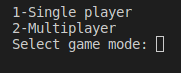
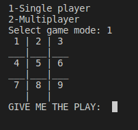
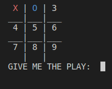
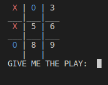
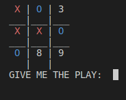
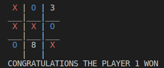

 

# UNIT 3 FUNCTIONS

 

 

## ***INDEX***

## ***DESCRIPTION***
In this unit we learned about c++ functions such as function types, how to call a function, etc. To better understand the subject we play the tic tac toe game.

 

# Tic tac toe 

 

## ***EXECUTION AND USE***
To play you need to follow the following steps:

1.-Compile and run the program.

2.- Then select the game mode.

3.-If you chose the player mode, you only have to choose between the boxes from 1 to 9 and then the PC will start automatically.

4.-If you chose the multiplayer mode, the first player must choose the box between 1 and 9 and then the second player.

5.- The game ends until one of the players wins or the boxes are finished and that is considered a tie.

## ***General considerations***
1.-The game was developed in linux please use this operating system.

2.- When you select the game mode, type the number 1 to play alone and 2 for multiplayer, if you select another number it will repeat the question to select the game mode and if you type a letter you can bug.

3.- When playing with one player, the player starts with the character "X" and then the PC with the character "O".

4.- When playing multiplayer player 1 uses the character "X" and player 2 uses the character "O".

5.- When you are playing, only choose whole numbers from 1 to 9.

## ***Flowchart***

 

 

 

## ***Explanation of a game execution***

Step 1: Ask the game mode you want.

 

Step 2: Select game mode 1, the board is built and the move is requested

 

Step 3: Select move 1 and the PC chose move 2.

 

Step 4: Select move 4 and the PC chose move 7.

 

Step 5: Select move 5 and the PC chose move 6.

 

Step 6: Finally select move 9 and I win

 

